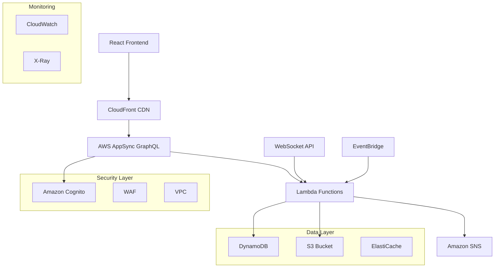
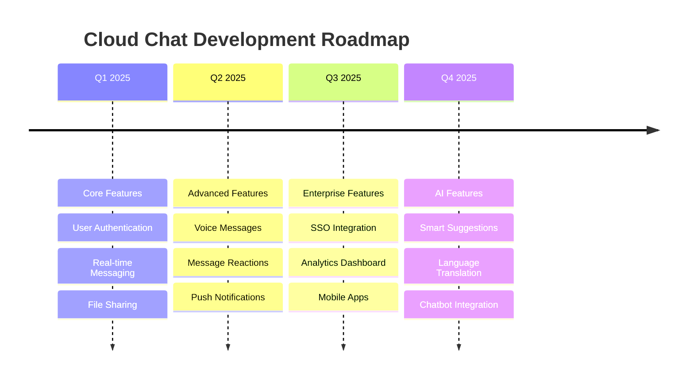

# 📡 Cloud Chat – Real-Time Messaging Platform

A **cloud-native, real-time messaging platform** that enables secure, scalable, and low-latency chat between users. Built to demonstrate modern cloud architectures, serverless technologies, and event-driven communication patterns with enterprise-grade security and performance.

---

## ✨ Features

### 🔒 **Authentication & Security**
- **Multi-Provider Auth:** Amazon Cognito integration with social logins (Google, Facebook, GitHub)
- **JWT Token Management:** Secure session handling with automatic token refresh
- **Role-Based Access Control:** Admin, moderator, and user permissions
- **End-to-End Encryption:** Message encryption at rest and in transit

### 💬 **Real-Time Messaging**
- **WebSocket Connections:** Sub-second message delivery via AWS AppSync
- **GraphQL Subscriptions:** Real-time updates with optimistic UI responses
- **Message Threading:** Organized conversations with reply chains
- **Typing Indicators:** Live typing status for enhanced UX
- **Message Reactions:** Emoji reactions and message interactions

### 📂 **Advanced Message Features**
- **Rich Media Support:** Image, video, and file sharing with S3 integration
- **Message History:** Infinite scroll with pagination and search
- **Message Status:** Read receipts and delivery confirmations
- **Message Editing:** Edit/delete messages with audit trails
- **Smart Notifications:** Intelligent push notifications via SNS

### 🚀 **Enterprise-Grade Architecture**
- **Auto-Scaling:** Serverless compute with AWS Lambda
- **Global Distribution:** CloudFront CDN for worldwide performance
- **High Availability:** Multi-AZ deployment with 99.9% uptime SLA
- **Monitoring:** Real-time metrics with CloudWatch and X-Ray tracing

### 🎨 **Modern User Experience**
- **Responsive Design:** PWA-ready with offline support
- **Dark/Light Themes:** Customizable UI themes
- **Accessibility:** WCAG 2.1 AA compliant
- **Mobile Optimized:** Native-like experience on all devices

---

## 🏗️ Architecture Overview



### **Data Flow Architecture**

1. **Authentication Flow:**
   - Users authenticate via Cognito with MFA support
   - JWT tokens issued with role-based permissions
   - Sessions managed with refresh token rotation

2. **Real-Time Communication:**
   - WebSocket connections established via AppSync
   - Messages published through GraphQL mutations
   - Subscribers receive updates via GraphQL subscriptions

3. **Message Processing:**
   - Lambda functions handle message validation and processing
   - DynamoDB stores messages with GSI for efficient querying
   - S3 handles media uploads with presigned URLs

4. **Notification System:**
   - SNS triggers push notifications for offline users
   - SES handles email notifications for important updates
   - EventBridge orchestrates complex notification workflows

---

## 🚀 Getting Started

### Prerequisites

- **Node.js** >= 18.0.0
- **AWS CLI** configured with appropriate permissions
- **Amplify CLI** >= 12.0.0 (`npm install -g @aws-amplify/cli`)
- **Docker** (optional, for local development)
- **Terraform** >= 1.0 (if using Terraform deployment)

### 1️⃣ Clone the Repository

```bash
git clone https://github.com/your-username/cloud-chat-platform.git
cd cloud-chat-platform
```

### 2️⃣ Install Dependencies

```bash
# Install root dependencies
npm install

# Install frontend dependencies
cd frontend
npm install

# Install backend dependencies
cd ../backend
npm install

# Return to root
cd ..
```

### 3️⃣ Configure Environment

Create environment configuration files:

**Frontend** (`frontend/.env`):

```env
# AWS Configuration
REACT_APP_AWS_REGION=us-east-1
REACT_APP_AWS_COGNITO_USER_POOL_ID=us-east-1_xxxxxxxxx
REACT_APP_AWS_COGNITO_CLIENT_ID=xxxxxxxxxxxxxxxxxxxxxxxxxx
REACT_APP_AWS_APPSYNC_GRAPHQL_ENDPOINT=https://xxxxxxxxxxxxxxxxxxxxxxxxxx.appsync-api.us-east-1.amazonaws.com/graphql
REACT_APP_AWS_APPSYNC_REGION=us-east-1
REACT_APP_AWS_APPSYNC_AUTHENTICATION_TYPE=AMAZON_COGNITO_USER_POOLS

# S3 Configuration
REACT_APP_S3_BUCKET=your-chat-media-bucket
REACT_APP_CLOUDFRONT_DOMAIN=https://xxxxxxxxxx.cloudfront.net

# Feature Flags
REACT_APP_ENABLE_PUSH_NOTIFICATIONS=true
REACT_APP_ENABLE_FILE_UPLOAD=true
REACT_APP_MAX_FILE_SIZE=10485760

# Analytics
REACT_APP_GOOGLE_ANALYTICS_ID=G-XXXXXXXXXX
```

**Backend** (`backend/.env`):

```env
# AWS Configuration
AWS_REGION=us-east-1
DYNAMODB_TABLE_MESSAGES=CloudChat-Messages
DYNAMODB_TABLE_USERS=CloudChat-Users
DYNAMODB_TABLE_ROOMS=CloudChat-Rooms

# S3 Configuration
S3_BUCKET_MEDIA=your-chat-media-bucket
S3_BUCKET_BACKUPS=your-chat-backups-bucket

# SNS Configuration
SNS_TOPIC_ARN=arn:aws:sns:us-east-1:123456789012:CloudChatNotifications

# Security
JWT_SECRET=your-jwt-secret-key
ENCRYPTION_KEY=your-encryption-key

# Rate Limiting
RATE_LIMIT_WINDOW=900000
RATE_LIMIT_MAX_REQUESTS=100
```

### 4️⃣ Deploy Infrastructure

Choose your preferred deployment method:

#### **Option A: AWS Amplify (Recommended)**

```bash
# Initialize Amplify project
amplify init

# Configure authentication
amplify add auth

# Configure API (GraphQL)
amplify add api

# Configure storage
amplify add storage

# Configure hosting
amplify add hosting

# Deploy everything
amplify push
```

#### **Option B: Terraform**

```bash
cd terraform

# Initialize Terraform
terraform init

# Plan deployment
terraform plan

# Apply infrastructure
terraform apply
```

#### **Option C: AWS CDK**

```bash
cd cdk

# Install CDK dependencies
npm install

# Bootstrap CDK (first time only)
cdk bootstrap

# Deploy stacks
cdk deploy --all
```

### 5️⃣ Configure AWS Services

#### **DynamoDB Tables Setup**

```bash
# Create Messages table
aws dynamodb create-table \
  --table-name CloudChat-Messages \
  --attribute-definitions \
    AttributeName=roomId,AttributeType=S \
    AttributeName=timestamp,AttributeType=S \
    AttributeName=userId,AttributeType=S \
  --key-schema \
    AttributeName=roomId,KeyType=HASH \
    AttributeName=timestamp,KeyType=RANGE \
  --global-secondary-indexes \
    IndexName=UserIndex,KeySchema=[{AttributeName=userId,KeyType=HASH}],Projection='{ProjectionType=ALL}',ProvisionedThroughput='{ReadCapacityUnits=5,WriteCapacityUnits=5}' \
  --provisioned-throughput ReadCapacityUnits=5,WriteCapacityUnits=5
```

#### **S3 Bucket Configuration**

```bash
# Create media bucket
aws s3 mb s3://your-chat-media-bucket

# Configure CORS
aws s3api put-bucket-cors \
  --bucket your-chat-media-bucket \
  --cors-configuration file://cors-config.json
```

### 6️⃣ Run Locally

#### **Development Mode**

```bash
# Start frontend development server
npm run dev:frontend

# Start backend services (in another terminal)
npm run dev:backend

# Start both concurrently
npm run dev
```

#### **Production Mode**

```bash
# Build frontend
npm run build:frontend

# Deploy to S3 and CloudFront
npm run deploy:frontend

# Deploy backend functions
npm run deploy:backend
```

---

## 🧪 Testing

### Unit Testing

```bash
# Run all tests
npm test

# Run frontend tests
npm run test:frontend

# Run backend tests
npm run test:backend

# Run with coverage
npm run test:coverage
```

### Integration Testing

```bash
# Run integration tests
npm run test:integration

# Run API tests
npm run test:api

# Run E2E tests
npm run test:e2e
```

### Load Testing

```bash
# Install Artillery
npm install -g artillery

# Run load tests
artillery run tests/load/websocket-load-test.yml
artillery run tests/load/api-load-test.yml
```

### Performance Testing

```bash
# Lighthouse CI
npm run test:lighthouse

# Bundle analyzer
npm run analyze:bundle
```

---

## 📊 Monitoring & Analytics

### CloudWatch Dashboards

- **Application Metrics:** Message throughput, user activity, error rates
- **Infrastructure Metrics:** Lambda performance, DynamoDB capacity, S3 usage
- **Real-Time Monitoring:** Active connections, message latency, system health

### Custom Metrics

```javascript
// Example custom metric logging
const AWS = require('aws-sdk');
const cloudwatch = new AWS.CloudWatch();

const putMetric = async (metricName, value, unit = 'Count') => {
  const params = {
    Namespace: 'CloudChat',
    MetricData: [{
      MetricName: metricName,
      Value: value,
      Unit: unit,
      Timestamp: new Date()
    }]
  };
  
  await cloudwatch.putMetricData(params).promise();
};
```

### Logging Strategy

```javascript
// Structured logging with Winston
const winston = require('winston');

const logger = winston.createLogger({
  level: 'info',
  format: winston.format.combine(
    winston.format.timestamp(),
    winston.format.errors({ stack: true }),
    winston.format.json()
  ),
  transports: [
    new winston.transports.Console(),
    new winston.transports.CloudWatchLogs({
      logGroupName: '/aws/lambda/cloud-chat',
      logStreamName: 'application-logs'
    })
  ]
});
```

---

## 🔧 Configuration

### Feature Flags

```javascript
// Feature flag configuration
const featureFlags = {
  enableFileUpload: process.env.REACT_APP_ENABLE_FILE_UPLOAD === 'true',
  enablePushNotifications: process.env.REACT_APP_ENABLE_PUSH_NOTIFICATIONS === 'true',
  enableMessageReactions: process.env.REACT_APP_ENABLE_MESSAGE_REACTIONS === 'true',
  enableVoiceMessages: process.env.REACT_APP_ENABLE_VOICE_MESSAGES === 'true',
  maxFileSize: parseInt(process.env.REACT_APP_MAX_FILE_SIZE) || 10485760,
  messageRetentionDays: parseInt(process.env.MESSAGE_RETENTION_DAYS) || 90
};
```

### Rate Limiting

```javascript
// Rate limiting configuration
const rateLimitConfig = {
  windowMs: 15 * 60 * 1000, // 15 minutes
  max: 100, // limit each IP to 100 requests per windowMs
  message: 'Too many requests from this IP',
  standardHeaders: true,
  legacyHeaders: false,
};
```

---

## 🔒 Security

### Authentication Flow

```javascript
// Cognito authentication setup
import { Amplify, Auth } from 'aws-amplify';

Amplify.configure({
  Auth: {
    region: process.env.REACT_APP_AWS_REGION,
    userPoolId: process.env.REACT_APP_AWS_COGNITO_USER_POOL_ID,
    userPoolWebClientId: process.env.REACT_APP_AWS_COGNITO_CLIENT_ID,
    mandatorySignIn: true,
    authenticationFlowType: 'USER_SRP_AUTH'
  }
});
```

### Message Encryption

```javascript
// Client-side encryption
const CryptoJS = require('crypto-js');

const encryptMessage = (message, key) => {
  return CryptoJS.AES.encrypt(message, key).toString();
};

const decryptMessage = (encryptedMessage, key) => {
  const bytes = CryptoJS.AES.decrypt(encryptedMessage, key);
  return bytes.toString(CryptoJS.enc.Utf8);
};
```

### Input Validation

```javascript
// Comprehensive input validation
const Joi = require('joi');

const messageSchema = Joi.object({
  content: Joi.string().max(1000).required(),
  roomId: Joi.string().uuid().required(),
  messageType: Joi.string().valid('text', 'image', 'file').required(),
  replyTo: Joi.string().uuid().optional()
});
```

---

## 📈 Performance Optimization

### Database Optimization

```javascript
// DynamoDB query optimization
const optimizedQuery = {
  TableName: 'CloudChat-Messages',
  KeyConditionExpression: 'roomId = :roomId',
  ExpressionAttributeValues: {
    ':roomId': roomId
  },
  ScanIndexForward: false, // Get latest messages first
  Limit: 50,
  ProjectionExpression: 'messageId, content, userId, timestamp, messageType'
};
```

### Caching Strategy

```javascript
// Redis caching for frequently accessed data
const redis = require('redis');
const client = redis.createClient({
  host: process.env.REDIS_HOST,
  port: process.env.REDIS_PORT
});

const cacheMessage = async (key, data, ttl = 3600) => {
  await client.setex(key, ttl, JSON.stringify(data));
};
```

### CDN Configuration

```javascript
// CloudFront cache behaviors
const cacheConfig = {
  static: {
    ttl: 31536000, // 1 year for static assets
    headers: ['Accept-Encoding']
  },
  api: {
    ttl: 0, // No caching for API responses
    headers: ['Authorization', 'Content-Type']
  }
};
```

---

## 🚀 Deployment

### CI/CD Pipeline

```yaml
# GitHub Actions workflow
name: Deploy Cloud Chat

on:
  push:
    branches: [main]

jobs:
  test:
    runs-on: ubuntu-latest
    steps:
      - uses: actions/checkout@v3
      - name: Setup Node.js
        uses: actions/setup-node@v3
        with:
          node-version: '18'
      - name: Install dependencies
        run: npm ci
      - name: Run tests
        run: npm test
      - name: Run security audit
        run: npm audit

  deploy:
    needs: test
    runs-on: ubuntu-latest
    steps:
      - uses: actions/checkout@v3
      - name: Configure AWS credentials
        uses: aws-actions/configure-aws-credentials@v2
        with:
          aws-access-key-id: ${{ secrets.AWS_ACCESS_KEY_ID }}
          aws-secret-access-key: ${{ secrets.AWS_SECRET_ACCESS_KEY }}
          aws-region: us-east-1
      - name: Deploy to AWS
        run: |
          npm run build
          npm run deploy:production
```

### Blue-Green Deployment

```bash
# Blue-green deployment script
#!/bin/bash

# Deploy to staging environment
npm run deploy:staging

# Run smoke tests
npm run test:smoke

# Switch traffic to new version
aws route53 change-resource-record-sets \
  --hosted-zone-id Z123456789 \
  --change-batch file://traffic-switch.json

# Monitor for 5 minutes
sleep 300

# Rollback if needed
if [ $? -ne 0 ]; then
  npm run rollback:production
fi
```

---

## 🐛 Troubleshooting

### Common Issues

#### WebSocket Connection Issues

```javascript
// WebSocket reconnection logic
const connectWebSocket = () => {
  const ws = new WebSocket(wsUrl);
  
  ws.onopen = () => {
    console.log('WebSocket connected');
    reconnectAttempts = 0;
  };
  
  ws.onclose = () => {
    console.log('WebSocket disconnected');
    if (reconnectAttempts < maxReconnectAttempts) {
      setTimeout(connectWebSocket, reconnectDelay);
      reconnectAttempts++;
    }
  };
  
  ws.onerror = (error) => {
    console.error('WebSocket error:', error);
  };
};
```

#### DynamoDB Throttling

```javascript
// Exponential backoff for DynamoDB
const exponentialBackoff = async (operation, maxRetries = 3) => {
  for (let i = 0; i < maxRetries; i++) {
    try {
      return await operation();
    } catch (error) {
      if (error.code === 'ProvisionedThroughputExceededException') {
        const delay = Math.pow(2, i) * 1000; // Exponential backoff
        await new Promise(resolve => setTimeout(resolve, delay));
      } else {
        throw error;
      }
    }
  }
};
```

### Debug Commands

```bash
# Check AWS resources
aws cognito-idp describe-user-pool --user-pool-id your-pool-id
aws dynamodb describe-table --table-name CloudChat-Messages
aws s3 ls s3://your-chat-media-bucket

# Monitor real-time logs
aws logs tail /aws/lambda/cloud-chat-message-handler --follow

# Test API endpoints
curl -X POST https://your-api.execute-api.us-east-1.amazonaws.com/prod/graphql \
  -H "Content-Type: application/json" \
  -d '{"query": "query { getMessages(roomId: \"test-room\") { content } }"}'
```

---

## 📊 Cost Optimization

### AWS Cost Breakdown

| Service | Monthly Cost (Est.) | Usage |
|---------|-------------------|-------|
| AWS Lambda | $5-20 | 1M requests |
| DynamoDB | $10-50 | 1GB storage, 1M reads |
| S3 | $5-15 | 10GB storage, 100K requests |
| CloudFront | $1-5 | 100GB transfer |
| Cognito | $0.50-2 | 1K active users |
| **Total** | **$21.50-92** | **Small-medium app** |

### Cost Optimization Tips

```javascript
// Optimize DynamoDB costs
const optimizeQuery = {
  // Use projection expressions to reduce data transfer
  ProjectionExpression: 'messageId, content, timestamp',
  
  // Use pagination to limit results
  Limit: 25,
  
  // Use eventual consistency for read operations
  ConsistentRead: false
};
```

---

## 📱 Mobile App Integration

### React Native Setup

```bash
# Install React Native CLI
npm install -g @react-native-community/cli

# Create React Native app
npx react-native init CloudChatMobile

# Install AWS Amplify for React Native
npm install aws-amplify @aws-amplify/react-native
```

### Push Notifications

```javascript
// Configure push notifications
import PushNotification from 'react-native-push-notification';

PushNotification.configure({
  onRegister: function(token) {
    console.log('TOKEN:', token);
    // Send token to your server
  },
  onNotification: function(notification) {
    console.log('NOTIFICATION:', notification);
    // Handle notification
  },
  permissions: {
    alert: true,
    badge: true,
    sound: true,
  },
  popInitialNotification: true,
  requestPermissions: true,
});
```

---

## 🔮 Future Enhancements

### Planned Features

- **AI-Powered Features**
  - Smart message suggestions
  - Sentiment analysis
  - Automatic language translation
  - Chatbot integration

- **Advanced Communication**
  - Video calling with WebRTC
  - Voice messages
  - Screen sharing
  - File collaboration

- **Enterprise Features**
  - Single Sign-On (SSO)
  - Advanced analytics
  - Message archiving
  - Compliance reporting

### Roadmap



---

## 🤝 Contributing

We welcome contributions from the community! Please follow these guidelines:

### Development Process

1. **Fork the repository**
2. **Create a feature branch** (`git checkout -b feature/amazing-feature`)
3. **Make your changes** with proper tests
4. **Commit your changes** (`git commit -m 'Add amazing feature'`)
5. **Push to the branch** (`git push origin feature/amazing-feature`)
6. **Open a Pull Request**

### Code Standards

```javascript
// ESLint configuration
{
  "extends": ["eslint:recommended", "@typescript-eslint/recommended"],
  "rules": {
    "no-console": "warn",
    "no-unused-vars": "error",
    "prefer-const": "error",
    "no-var": "error"
  }
}
```

### Testing Requirements

- Unit tests for all new features
- Integration tests for API endpoints
- E2E tests for critical user journeys
- Performance tests for scalability


---

## 🙏 Acknowledgments

- **AWS Team** for providing excellent cloud services and documentation
- **React Community** for the amazing frontend framework and ecosystem
- **GraphQL Foundation** for the powerful query language
- **Open Source Contributors** who make projects like this possible

### Special Thanks

- [AWS Amplify](https://aws.amazon.com/amplify/) - For simplified cloud development
- [Apollo GraphQL](https://www.apollographql.com/) - For excellent GraphQL tools
- [React](https://reactjs.org/) - For the component-based architecture
- [Serverless Framework](https://www.serverless.com/) - For serverless deployment tools

---

## 📞 Support & Community

### Get Help

- 📧 **Email Support:** [sajidrahman@dal.ca](mailto:sajidrahman@dal.ca)


### Community Guidelines

- Be respectful and inclusive
- Help others learn and grow
- Share knowledge and best practices
- Report issues constructively
- Contribute to discussions meaningfully

---

## 📊 Project Stats


---

*Built with ❤️ by the Cloud Chat Team*
